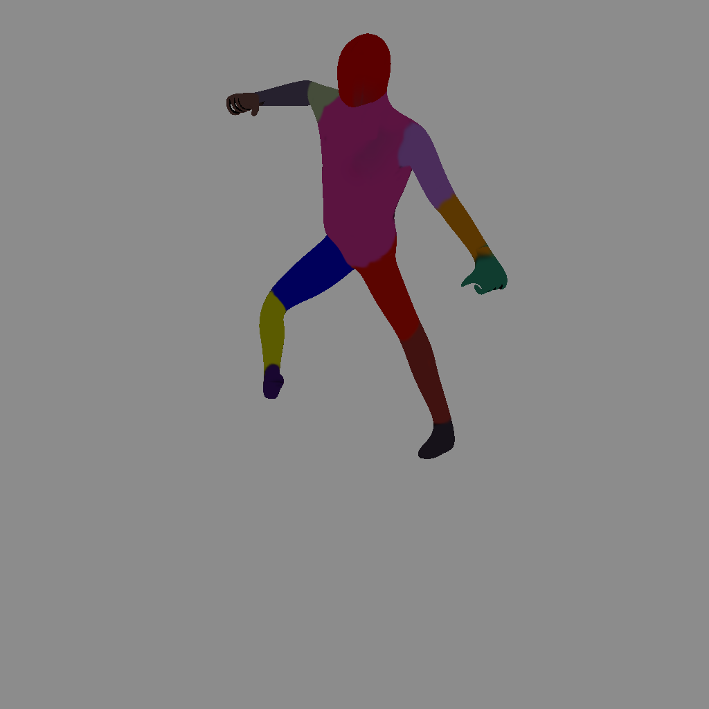
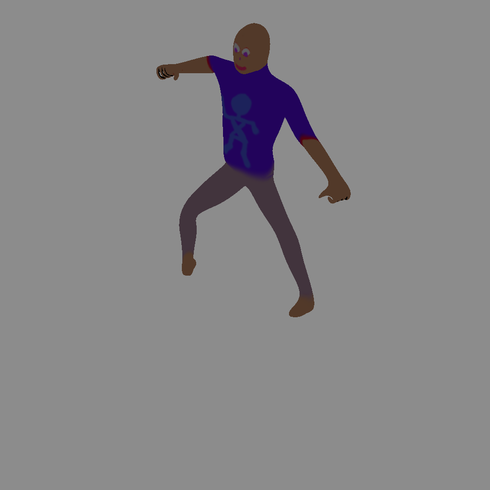

# synthposes

`synthposes` generates a synthetic training set for human pose estimation according to a modified version of "Efficient Human Pose Estimation from Single Depth Images" by Shotton et al.

# Usage

Modify the environmental variables `OUTPUT_DIR` (the directory to output to, ending with a trailing slash) and `COUNT` (the number of samples to generate as desired) upon invoking `test.sh`.

By default, synthpose is single-threaded and is intended to be used with multiple instances in parallel for multicore machines. Note OUTPUT_DIR should be different per core for this use case, to avoid file name collisions.

synthpose is known to work on Debian Stretch (GNU/Linux) with blender 2.77. Other distributions should also work. Other blender versions possibly work.

# A sample

Competent texture artists wanted :-)
